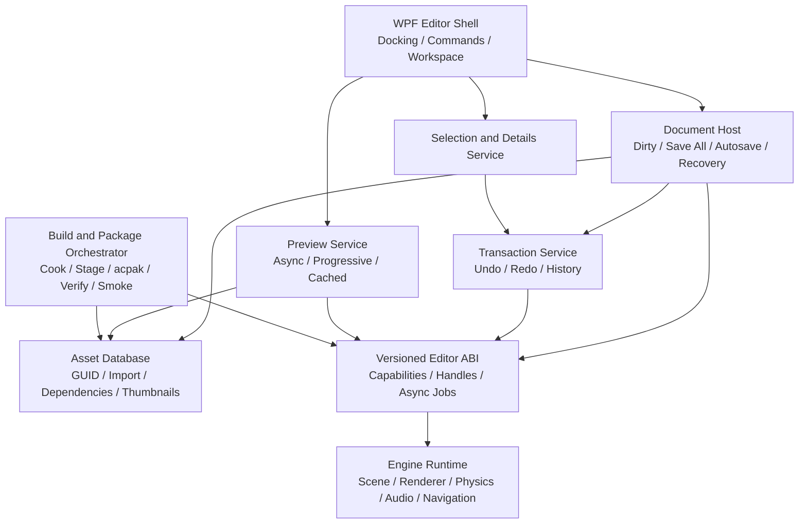

# ACS Editor Production Roadmap

更新日: 2026-07-27

## 目的

この文書は、ACS Editor を「見た目だけ UE に似せたツール」ではなく、ゲームの作成、反復確認、ビルド、パッケージ、配布までを一貫して完了できるプロダクション用エディタへ発展させるための実装ロードマップである。

UE と同等という表現は、単一機能の有無ではなく、次のワークフロー品質を目標とする。

- 編集した内容が、Play、Standalone、Package の全経路で同じ結果になる。
- クラッシュや誤操作から作業を復旧できる。
- アセットの移動や改名で参照が壊れず、依存関係を追跡できる。
- すべての主要編集操作を Undo/Redo できる。
- 大規模プロジェクトでも検索、ロード、プレビュー、ビルドが予測可能な時間で完了する。
- エラーを「ビルド成功」に見せず、原因と修正箇所をエディタ上で説明できる。
- 配布物を再現可能な手順で生成し、起動確認まで自動化できる。

本調査は 2026-07-27 時点の WPF Editor、Editor ABI、ランタイム、既存ツール群を対象にした。記載する行番号は調査時点の証跡であり、コード変更により移動する可能性がある。

## 結論

ACS Editor には、シーンアウトライナー、詳細パネル、2D/3D ビューポート、Play 制御、Blueprint、ノードベースの Material Editor、プロジェクト設定、リフレクションベースのコンポーネント編集など、エディタの核になる機能がすでにある。

以前の最優先ブロッカーだった新規 3D authoring と実行・配布の二重経路は、2D/3D 共通の `Assets/main.acs3d`、manifest の canonical Scene Asset ID、3D runtime bootstrap、required-only dependency-closure Cook によって vertical slice が成立した。2D template は別 Scene 形式ではなく、同じ 3D world を XY Orthographic で開く preset である。現時点の最重要課題は、runtime/package adapter の対応範囲を Editor authoring 全体へ広げること、旧 project を安全に移行すること、共通 document/transaction と製品配布基盤を完成させることである。

### 現状スコアカード

| 領域 | 現状 | プロダクション上の主要不足 | 優先度 |
|---|---|---|---|
| シーン / Outliner | 新規2D/3D共通の `.acs3d` world、Orthographic preset、legacy adapter、階層、検索、複数選択、DnD、Scene Save All、自動保存・復旧あり | runtime adapter の全 authoring directive 対応、3D sibling reorder、subscene | P0 |
| Details / Components | Transform、コンポーネント追加削除、反射プロパティ、CallInEditor あり | 複数選択編集、mixed value、reset/copy/paste/diff、配列・構造体編集 | P1 |
| Asset Browser | Import、監視、current/subfolder/all-assets 検索、サムネイル、配置、Material 変換、永続 GUID/DB、依存・参照元、Reference Viewer あり | tag filter、追加 importer の設定 UI、DDC | P0 |
| Undo / Redo | Scene、Blueprint、Material graph に個別 snapshot 履歴。Scene 自動保存・復旧、Material graph の共通 host transaction 参加あり | cross-document command routing、Asset/Settings の履歴、履歴表示 | P0 |
| Play / Preview | Play/Pause/Step/Stop、状態復元、Game View、Hot Reload、対応済み `.acs3d` runtime bootstrap あり | runtime adapter の全3D directive parity、Possess/Eject/Simulate、Play 設定、複数クライアント | P0/P1 |
| Build / Package | Windows x64、Development/Test/Shipping、canonical Scene Asset ID起点のdependency-closure Cook、`.acpak`/ZIP、native verify、manifest、3D fail-closed あり | 製品 metadata、署名、installer、自動 smoke、他 platform | P0 |
| Project Settings | schema 駆動 UI、検索、検証、保存、snap 値同期あり | Editor/User 設定分離、Input/Packaging/Platform 等 | P0/P1 |
| Material Editor | typed node graph、semantic Undo/Redo、Document Host dirty/Save All/close、compile diagnostics、CPU-safe async/cancellable preview、192/256/384 px 出力、同一入力 LRU cache、計測表示あり。native preview API に HDR/ACES、1x–4x SSAA、3種 mesh/background 契約あり | legacy property writer の transaction 化、native API を live window へ接続する fenced GPU readback、instance/function、shader cache | P0/P1 |
| Profiler / Diagnostics | Profiler v3 の CPU/GPU/pass 計測、UI stall watchdog、独立した cloud-workload-v1 の dispatch/invocation/history/sample ceiling 表示あり | GPU capture、allocation tracker、platform telemetry、継続 performance budget | P1 |
| Prefab / Blueprint | 保存、配置、Apply/Revert、graph undo あり | property override、nested prefab、variant、conflict/diff、安定 ID | P2 |
| Navigation | 2D grid A* と Tilemap bridge あり | 3D navmesh、bake UI、agent/area/link、debug/cook | P2 |
| Editor UX | メニュー、toolbar、panel toggle、主要 shortcut、command palette、per-user layout 永続化あり | docking、multi-document、shortcut editor、複数 workspace | P1 |
| Release operations | Windows x64 deterministic ZIP、runtime 依存解決、Cook/`.acpak` native verify、manifest hash あり | metadata、署名、installer、patch、store upload、他platform | P0/P3 |

ステータスを要約すると、現在は「対応済みの Scene/Asset 範囲を決定的かつ fail-closed に Windows x64 へ出荷できる開発用エディタ」であり、Editor の全 authoring 機能、製品 metadata、署名、installer、継続 smoke を備えた統合環境にはまだ達していない。

## 最優先の残課題: 3D authoring と runtime/package adapter の完全 parity

新規 `3d` と `2d` project はどちらも `Assets/main.acs3d` を作成し、`2d` は同じ world を XY Orthographic preset で開く。manifest は初期 Scene の persistent Asset ID を保持し、Build/Run/Package は source format と project runtime capability を共通 guard で検証する。

- `editor/AcsEditor/ProjectManager.cs`
- `editor/AcsEditor/MainWindow.BuildCompatibility.cs`
- `editor/AcsEditor/CanonicalSceneAdapter.cs`
- `editor/AcsEditor/PackageCore.cs`

新規 project source は `FLegacyScene3DAdapter` bootstrap capability を宣言する。一方、旧 project がこの capability を持たない場合は、active `.acs3d` の Build/Run/Package を `ACS-BUILD-3D-PARITY-001` で停止し、別の 2D payload を黙って出力しない。Package の reversible `ACS3D v2` adapter も対応 directive だけを Cook し、未対応 content を structured diagnostic で拒否する。

### 残っている統一

1. `SPR3D`、`PLY3D`、`PFAB3D` など、現在 fail-closed にしている authoring directive を runtime/package adapter へ実装する。
2. 旧 `.acscene` と capability marker を持たない旧 3D project の migration、round-trip、broken-reference recovery を継続検証する。
3. すべての Scene picker、Play、Standalone、Package が path ではなく canonical Asset ID を最終 authority とする。
4. multi-scene/subscene、level streaming、world partition を共通 document/dependency contract 上へ追加する。

### P0 受け入れ条件

- 新規 3D プロジェクトを作成し、Cube と Light を追加して Save、Editor 再起動、Play、Standalone、Package 後の起動で同じ hierarchy、component、transform を確認できる。
- Build 対象 Scene に未保存変更があれば Save All または明示的な中止を選べる。
- source 側の固定 filename に依存せず、Project manifest の Asset ID から既定 Scene を解決し、Cook 後だけを契約済みの `main.acscene` bootstrap path に正規化する。
- 旧 2D Scene の migration test と、新 2D/3D Scene の round-trip test が CI で通る。
- 対応していない Scene 種別は Build を失敗させ、対象 Asset、期待形式、修正手順を Build Results に表示する。

## 現状監査

### 1. Editor Shell と ABI

WPF Shell は `.NET 10 / Windows / win-x64` で、Editor ABI は Raw DX12 構成に限定される。

- `editor/AcsEditor/AcsEditor.csproj`
- `engine/CMakeLists.txt:152-164`

managed/native 接続は `EngineInterop.cs` の P/Invoke と `EditorAbi.cpp` に集中しているが、接続前の数値 contract と capability negotiation は実装済みである。managed host は versioned `acs_editor_abi_query` へ必須 bit を渡し、provider version、既知/未知 capability、構造体 version/size を検証する。Profiler v3 と packed 168-byte の `cloud-workload-v1` は独立した optional capability であり、後者を追加しても既存 Profiler snapshot を再解釈しない。

- `editor/AcsEditor/EngineInterop.cs`
- `editor/AcsEditor/EditorAbiContract.cs`
- `editor/AcsEditor/EditorCloudWorkload.cs`
- `src/editor_abi/EditorAbiCapabilities.h`
- `src/editor_abi/EditorCloudWorkload.h`
- `src/editor_abi/EditorAbi.cpp`

旧 DLL、version mismatch、必須 capability 不足、bad image は native host 作成前に fail-closed となる。残る課題は、service ごとの typed error payload と operation ID、汎用 async job/cancellation ABI、renderer backend 抽象化、optional service 単位の UI disable である。

### 2. Scene、Outliner、Viewport

実装済み:

- 2D hierarchy、visibility、node icon、collapse state。
- 名前検索と祖先表示。
- Ctrl 複数選択、2D の before/after/child DnD、3D reparent。
- picking、orbit、pan、zoom、gizmo、box selection。
- move/rotate/scale snap、focus、frame、align、distribute。
- Scene dirty 判定、New/Open/Close 時の保存確認。

主な証跡:

- `editor/AcsEditor/MainWindow.xaml:202-302`
- `editor/AcsEditor/MainWindow.xaml.cs:634-735`
- `editor/AcsEditor/MainWindow.xaml.cs:839-970`
- `editor/AcsEditor/EngineViewport.cs`
- `editor/AcsEditor/MainWindow.Workspace.cs:19-185`

不足:

- 3D sibling order の編集。
- WASD/fly camera、speed modulation、camera bookmark、local/world/pivot mode。
- multi-scene/subscene、level streaming、world partition の編集 UI。
- recent scene、broken-reference recovery。
- selection set、folder/collection、Outliner column/filter、lock/isolate。

### 3. Details と Component 編集

実装済み:

- 3D の Transform の下に Components が並び、Mesh Renderer も通常の native component card として配置される。
- 2D/3D の component add/remove、反射 property editor、category、CallInEditor button。
- Details 内検索。

主な証跡:

- `editor/AcsEditor/MainWindow.Details.cs:16-65`
- `editor/AcsEditor/MainWindow.View3D.cs:219-483`
- `editor/AcsEditor/MainWindow.xaml.cs:2706-2995`

現在の 2D 複数選択 Details は表示専用で、編集を無効化している。

- `editor/AcsEditor/MainWindow.xaml.cs:2226-2264`
- `editor/AcsEditor/MainWindow.xaml:530-532`

不足:

- 複数選択の共通 property 編集と mixed value。
- reset to default、copy/paste property/component、component reorder。
- prefab/source/default との差分表示。
- array、map、nested struct、object reference、soft reference の一貫した editor。
- property validation、asset picker の type filter、browse/use-selected。
- Details lock と複数 Inspector。

### 4. Asset Browser と Asset Registry

Asset Browser はファイル監視、Import、current folder / subfolders / all Assets の明示的な検索スコープ、サムネイル、配置に加え、隣接 `.acsmeta` の安定 GUID と `Assets/.acsdb/index.v1.json` の決定的 index を使う。全 Assets 検索は UI thread から filesystem を再走査せず、immutable DB snapshot を background task で絞り込む。DB は source/importer/version/import settings、SHA-256、依存 Asset ID を保持し、Reference Viewer は直接・推移依存と参照元、欠損 ID、循環を読み取り専用で表示する。

New Asset の実装は認識済み ACS 形式だけに閉じている。ツールバーと背景コンテキストメニューから Folder、Material (`.acsmat`)、統一 Scene (`.acs3d`)、Blueprint (`.acsbp`)、Prefab (`.acsprefab`) を作成でき、作成後は新規項目を選択してインライン rename を開始する。payload は同一ディレクトリの一時名へ完全に書いてから no-overwrite move で公開し、Windows 予約名、大小文字を無視した payload/metadata/material-graph 衝突、`Assets/.acsdb` と一時領域、reparse point、Assets 外への書き込みを拒否する。キャンセルまたは serializer 失敗時は material graph と metadata を含む一時 family を除去する。

検証入口は `--asset-creation-selftest`。同じ契約は `--asset-browser-selftest` の aggregate にも含まれる。

- `editor/AcsEditor/AssetBrowserPanel.xaml:12-117`
- `editor/AcsEditor/AssetBrowserPanel.xaml.cs:68-197`
- `editor/AcsEditor/AssetBrowserPanel.xaml.cs:225-316`
- `editor/AcsEditor/AssetDatabase.cs`
- `editor/AcsEditor/AssetReferenceViewerWindow.xaml.cs`
- `tools/acsassetdb/Program.cs`

runtime の `FAssetRegistry` は loader と path-hash cache であり、editor database とは責務が異なる。現在の editor database では GUID が identity であり、DB API 経由の move と一意 content hash による外部 rename recovery で identity を維持する。

- `src/asset/AssetRegistry.h:47-168`
- `src/asset/AssetRegistry.cpp:90-98`

不足:

- importer ごとの実 reimport pipeline と設定 UI。
- tag filter と検索条件を再利用できる dynamic collection。
- 追加 asset type の作成を公開する場合の canonical serializer と schema migration。
- thumbnail cache と Derived Data Cache。

Asset DB より先に自由な rename/move/delete を追加すると参照破壊を UI から簡単に起こせるため、順序を逆にしてはならない。

### 5. Undo、Redo、Document

Scene は native snapshot を最大 128 件保持し、drag 中の連続操作を一つにまとめる。Blueprint Editor は別の snapshot 履歴を最大 100 件保持する。

- `src/editor_abi/EditorAbi.cpp:1585-1598`
- `src/editor_abi/EditorAbi.cpp:7716-7774`
- `editor/AcsEditor/MainWindow.xaml.cs:3108-3124`
- `editor/AcsEditor/BlueprintEditor.xaml.cs:3383-3416`

Scene は dirty 状態に連動する世代管理付き自動保存、checksum 検証、起動時 recovery dialog と、2D/3D の初期化済み dirty 文書を mode switch なしで原子的に保存する Save All を持つ。共通の deterministic/async Document Host と Scene adapter は実装済みで、Scene の dirty、Save、Close を host 経由で扱える。Material Editor の authored Substrate graph も stable Asset ID、dirty、Save All、共通 close confirmation、graph gesture transaction まで host に参加した。legacy material property writer、Material autosave/recovery、Blueprint/Prefab/Settings adapter、multi-document tab UI、cross-document command routing はまだ移行作業として残る。

- `editor/AcsEditor/MainWindow.Autosave.cs`
- `editor/AcsEditor/SceneAutosaveStore.cs`
- `editor/AcsEditor/SceneRecoveryDialog.xaml.cs`
- `editor/AcsEditor/MainWindow.SaveAll.cs`
- `editor/AcsEditor/SceneSourceFile.cs`

不足:

- `EditorDocumentHost` への Blueprint/Prefab/Settings adapter、Material legacy property adapter、multi-document tab、`IEditorCommand`、cross-document command routing。
- property delta と object identity に基づく Undo。
- Scene、Material、Blueprint、Prefab、Settings、Asset operation の共通履歴。
- Undo History UI、coalescing policy、transaction test。
- Scene 以外の document autosave/recovery と共通 close confirmation。

### 6. Play、Game View、Hot Reload

Play/Pause/Resume/Step/Stop、native physics、reflect DLL の user logic、停止時の Scene 復元、Game View、Standalone 起動、source watcher による Hot Reload は存在する。

- `editor/AcsEditor/MainWindow.xaml.cs:1069-1135`
- `editor/AcsEditor/MainWindow.xaml.cs:1787-1906`
- `src/editor_abi/EditorAbi.cpp:6954-6975`

不足:

- 3D Scene と packaged runtime の parity。
- Selected Viewport、New Window、Standalone、Simulate の明確な Play mode。
- Possess/Eject、spawn location、game instance 設定。
- runtime world と editor world の分離表示。
- multiplayer / multi-client launch。
- breakpoint、frame profiler、memory/GPU capture への導線。

### 7. Build、Package、Distribution

現状の Build は CMake configure/build、reflect DLL build、Release executable build、Scene copy、external launch までを行う。Package の vertical slice はWindows x64 Release executable、解決済みruntime DLL、ConfigとCook済み`game.acpak`をstagingし、native CRC verify、pack SHA-256、content build ID、固定timestamp/orderのdeterministic ZIPをatomic replaceで生成する。Development/Test/Shipping profileを持ち、Test/Shipping runtimeはpackからscene/material/textureを直読する。Cook は manifest の canonical Scene Asset ID を唯一のrootとしてAsset DB dependency closureだけを決定的順序で収集し、未使用Assetを除外する。到達可能な欠損・循環・path escape・stale metadata・未対応形式はstructured diagnosticでfail-closedとなり、3D runtime bootstrap capabilityを検証できない旧projectのactive 3D documentは共通guardでfail-closedになる。

- `editor/AcsEditor/BuildService.cs:41-127`
- `editor/AcsEditor/PackagingService.cs:15-101`
- `editor/AcsEditor/PackageCore.cs:379-535`
- `editor/AcsEditor/PackageCore.cs:776-806`
- `editor/AcsEditor/MainWindow.BuildCompatibility.cs:12-71`
- `editor/AcsEditor/MainWindow.xaml.cs:1787-1837`

既存の `acs_assetpack` のrecursive pack、list、unpack、verify、info、LZ4を再利用し、packer固有形式を新設していない。入力順はvirtual path ordinalへ固定し、reparse pointもCLI自身が拒否する。

- `tools/acs_assetpack/main.cpp:59-99`
- `tools/acs_assetpack/main.cpp:305-`
- `docs/AssetPack.md:183-210`
- `docs/AssetPack.md:335-336`
- `engine/CMakeLists.txt:201-206`

不足:

- app name、icon、license、credits、release channel 等の製品 metadata。
- signing、installer、delta/update 方針。
- packaged executable の継続的なautomated smoke launch。
- cook/packageの詳細timing report。
- Windows 以外の target、または remote build contract。

### 8. Project Settings と Editor Preferences

Project Settings は native schema catalog から UI を生成し、検索、category、validation、apply、save を行う。Rendering、Editor snap、Physics、Game の一部設定がある。

- `editor/AcsEditor/ProjectSettingsWindow.xaml.cs:47-76`
- `src/gameframework/ProjectSettings.cpp:25-125`

以前は native 側で Project Settings の snap 値を適用した後、WPF workspace 初期化が managed 既定値を再送していた。現在は native settings を managed toolbar state へ同期し、初期化時には `acs_editor_set_snap` を呼ばないため、この上書きは解消している。

- `src/editor_abi/EditorAbi.cpp:5220-5222`
- `editor/AcsEditor/MainWindow.Workspace.cs:33-79`
- `editor/AcsEditor/MainWindow.xaml.cs:452-457`

不足:

- Project Settings と per-user Editor Preferences の分離。
- Input mapping、Packaging、Platform、Audio、Localization、Source Control。
- last folder と viewport preference の per-user 永続化。workspace layout と
  panel size の per-user 永続化は実装済み。
- schema migration、settings diff、invalid setting の recovery。

### 9. Material Editor と Preview

Material Editor は typed node palette、graph canvas、compile diagnostics、PBR property、native GPU preview API、CPU-safe fallback を持つ。native API 側には linear HDR render target、ACES/sRGB resolve、1x/2x/4x SSAA、Sphere/Cube/Plane、Studio/Checker/Black background の契約があるが、共有 viewport RHI の resource-lifetime race を避けるため、現在の live window にはまだ接続していない。live window は単一 mesh/background の CPU-safe renderer と 192/256/384 px の出力解像度 preset、180 ms debounce を使い、未接続の mesh/background selector は無効化して理由を表示する。

- `editor/AcsEditor/MaterialEditorWindow.xaml:234-296`
- `editor/AcsEditor/MaterialEditorWindow.xaml.cs`
- `editor/AcsEditor/MaterialPreviewPipeline.cs`
- `editor/AcsEditor/MaterialPreviewSelfTest.cs`
- `src/editor_abi/EditorAbi.cpp:12144-12310`

第2 vertical slice では CPU generation を dispatcher 外へ移し、入力変更時点での cooperative cancellation と generation token による stale result suppression、同一入力の in-flight coalescing、8 entry LRU cache、generation time/cache hit 表示を追加した。出力解像度は immutable request key に含め、失敗時は last-good image を保持する。mesh/background は将来の fenced native GPU path 用 request contract として残すが、live window からは既定値だけを渡す。

不足:

- Material graph の既存 semantic Undo/Redo と host transaction を統合する共通 Undo History UI。
- Material Instance、parameter collection、function/subgraph。
- native GPU submit/readback の専用 queue、fence、非同期 readback、shutdown drain。
- compiled shader cache と runtime 基準 screenshot test。

### 10. Prefab と Blueprint

Prefab と Blueprint は subtree 保存、2D/3D 配置、source link、Apply/Revert を持つ。Blueprint graph には独自 Undo もある。

- `editor/AcsEditor/MainWindow.xaml.cs:2429-2601`
- `editor/AcsEditor/MainWindow.xaml.cs:2666-2751`
- `editor/AcsEditor/BlueprintEditor.xaml.cs:3383-3416`

現在の Prefab Apply は subtree 全体を書き戻し、他 instance を再生成する。property 単位の override model ではない。

不足:

- stable instance/object ID。
- property/component override と selective Apply/Revert。
- nested prefab、variant、inheritance。
- source 更新時の conflict、diff、rebase。
- break/relink、missing source recovery。
- Asset rename と dependency graph への参加。

### 11. Navigation

runtime には 2D grid A* と Tilemap からの walkability bridge がある。

- `src/gameframework/Pathfinding.h:46-147`
- `src/gameframework/TilemapNav.h:3-41`
- `src/gameframework/TilemapNav.cpp:11-31`

WPF Editor/Editor ABI には NavMesh authoring の統合が見当たらない。

不足:

- 3D navmesh generation。
- agent radius/height/slope/step、area/cost、modifier volume、off-mesh link。
- incremental bake、tile cache、bake report。
- viewport overlay、path query debug、invalid geometry visualization。
- runtime query filter、dynamic obstacle、crowd。
- cooked nav data と Scene dependency。

Navigation は Scene collider contract と Asset DB に依存するため、P0 基盤の後に実装する。

### 12. 既存 authoring tool の再利用

`src/gameframework/tools/` には animation curve、behavior tree、cinematic timeline、level、model、particle、sprite atlas、font などの既存 tool がある。しかし、主要 WPF workspace から統合されていない。

再実装を始める前に、各 tool を次の三層に分解する。

1. document/model と serializer。
2. preview/runtime adapter。
3. ImGui または WPF の view。

アルゴリズム、serializer、validation は再利用し、WPF workspace には document tab と command/transaction adapter を追加する。これにより UI の一貫性と既存資産の両方を維持できる。

## 目標アーキテクチャ



重要な原則:

- UI control から直接 P/Invoke と file I/O を呼ばず、application service を介す。
- object pointer や path ではなく、stable document/object/asset ID を境界に使う。
- 長時間処理は job ID、progress、cancellation、structured diagnostic を持つ。
- Scene、Material、Blueprint、Prefab を同じ document lifecycle に参加させる。
- Editor 表示用 preview と Shipping renderer の shader/material contract を共有する。
- Build と Package は UI 専用ロジックにせず、CLI/CI から同じ pipeline を呼べるようにする。

## 実装ロードマップ

### P0-A: Scene と Runtime の統一

成果物:

- versioned Scene schema と migration。
- 2D/3D 共通 document contract。
- Project manifest の default Scene Asset ID。
- Editor Play、Standalone、Package 共通 loader。
- 3D project template。

実装済み基盤:

- Initial Scene の移動追従を永続 journal に記録し、Project Settings と manifest の片側だけが更新された状態を起動時に検証して復旧する。
- `.acsproject` version 1 の bounded/strict UTF-8 contract、case-insensitive duplicate/property binding、未対応 version・不正 field type・zero GUID・Unicode format spoof の fail-closed 検証を共通 snapshot parser に統合した。BOM 付き legacy manifest の移動追従と journal recovery は canonical no-BOM 出力へ安全に収束する。
- `canonicalSceneAssetId` が空の旧 manifest は、起動時の共通 recovery lease 内で初期 Scene の authoritative `.acsmeta` を確定してから、未知 field を保持した atomic manifest 更新で一度だけ backfill する。欠落 Scene、path/ID 不一致、重複 identity は manifest を変更せず fail-closed とし、既に ID を持つ project では全 Asset scan を行わない。`--scene-save-selftest` が BOM/未知 field 保持、再試行の冪等性、競合 ID と欠落 Scene の拒否を固定する。

依存: なし。すべての最優先作業の起点。

完了条件:

- 前述の 3D round-trip/Play/Standalone/Package parity test が通る。
- 2D 既存 sample の互換 test が通る。
- Scene の未対応 version と broken reference を structured diagnostic で報告する。

### P0-B: Versioned Editor ABI と Service 境界（初期 negotiation と cloud workload 実装済み）

成果物:

- 実装済み: 数値 contract version、feature bit、required/optional capability query、構造体 version/size 検証。
- 実装済み: legacy/future/missing capability の fail-closed smoke test と起動診断。
- 実装済み: Profiler v3 から独立した `cloud-workload-v1` snapshot。dispatch、logical/launched invocation、history、sample ceiling、skip reason を exact native workload から表示する。
- 残り: typed error code/diagnostic payload、operation ID、async job API/cancellation。
- 残り: managed 側の Scene、Asset、Preview、Build service interface と optional service 単位の UI disable。

依存: P0-A と並行可能。新 Scene API の境界を先に定義する。

完了条件:

- 実装済み: Editor と ABI の version 不一致で crash せず、native host を作らず理由を表示する。
- 実装済み: optional feature を product label や symbol の推測ではなく capability で判定する。
- 残り: native error を Build Results/Output Log の Asset と operation に紐づけ、service 単位で利用不可 UI を disable する。

### P0-C: Document、Transaction、Autosave（共通 host 基盤、Scene、Material graph 統合済み）

成果物:

- 実装済み: deterministic/async `EditorDocumentHost` と `EditorDocument`、Scene adapter、Scene の Save、Save All、dirty、close confirmation、Material graph adapter の stable Asset ID、dirty、Save All、close、gesture transaction。
- 残り: Material legacy property、Blueprint/Prefab/Settings adapter と multi-document tab。
- 共通 transaction scope と Undo History。
- autosave journal、recovery dialog、世代管理。

依存: stable object/document ID は P0-A/B と合わせる。

完了条件:

- Scene property、Material node、Blueprint node、Prefab override、Project setting を各 10 操作行い、順逆に Undo/Redo して byte-equivalent または semantic-equivalent に戻る。
- drag と text typing が policy に従って coalesce される。
- Editor process を強制終了して再起動し、最後の autosave から document を選択復旧できる。
- Save All 後は全 tab と Project の dirty state が一致する。

### P0-D: Asset Database、Import、Dependency

成果物:

- stable GUID と metadata。
- persistent Asset DB と schema migration。
- importer registry、import settings、source hash、reimport。
- dependency/referencer index。
- atomic rename/move と redirect/migration。
- thumbnail/derived data cache。

実装済み基盤:

- Import/Reimport の prepare/commit journal を Project 起動時に同一の変更リース内で復旧し、不完全なペイロードとサイドカーを Asset DB 走査前に確定する。
- 画像 decode を UI モデルから独立したワーカーへ分離し、decode 済みの不変な結果だけをディスパッチャーへ戻す。

依存: P0-A の Scene reference、P0-C の asset operation transaction と協調する。

完了条件:

- texture、material、prefab、scene の参照 chain を作り、元 texture を folder 間で移動・改名しても参照が維持される。
- source file 変更を検出し、reimport preview と apply/cancel を選べる。
- safe delete が referencer を列挙し、未解決参照を残す削除を既定で拒否する。
- Project 再起動後も GUID、import settings、dependency が一致する。
- 10 万 Asset 相当の index を fixture で検証し、検索が UI thread の全件列挙にならない。

### P0-E: Build Profile、Cook、Package、Smoke Test

実装済み vertical slice:

- Windows x64 Release build、runtime DLL dependency resolution。
- deterministic staging/ZIP、file hash manifest、atomic replacement。
- Package preflight/progress UI と active 3D fail-closed。
- Development/Test/Shipping profile。
- deterministic asset Cook、`acs_assetpack pack` + native `verify`。
- pack SHA-256/format/compression/source countを含むmanifest。
- Test/Shipping runtimeのpack直読とno-loose-fallback。
- Editor と CI が共有する CLI/API。
- Package の事前検証をデバウンス付きの非同期ワーカーで実行し、公開直前に変更リースを再取得して Initial Scene journal とアセット identity を再検証する。
- `canonicalSceneAssetId` を唯一のrootにするrequired-only dependency closure。未使用AssetはCookの形式・参照検証とgraph hashから除外し、到達可能な欠損、循環、escape、stale metadata、未対応形式だけを明示的に拒否する。complete treeに対するmetadata authority、path、reparse-point safetyは維持する。空または不正なcanonical IDは旧pathへfallbackせず、Editorでのmigrationを案内してfail-closedにする。

残り成果物:

- 製品 metadata、署名、installer。
- package report と launch smoke test。

依存: P0-A と P0-D が必須。P0-B の async job/diagnostic を利用する。

完了条件:

- Clean checkout から一つのコマンドで Shipping package を作成できる。
- package に未使用 Asset が入らず、必要 Asset の欠落は cook 時に失敗する。
- `acpak verify`、manifest hash 検証、別 staging directory からの executable 起動が成功する。
- 同一 source/config/toolchain から生成した manifest と logical asset hash が一致する。
- Build Results に configure、compile、cook、stage、pack、verify、smoke の所要時間と結果を表示する。

### P1-A: UE 型 Workspace UX

成果物:

- docking、tab tear-off、multi-monitor、named workspace。
- layout と panel size の per-user 永続化。
- multi-document tab、Recent、Favorites。
- command registry、command palette、shortcut editor。
- Output Log、Message Log、Build Results、Task Progress の統一。

依存: P0-B/C。

完了条件:

- Editor 再起動後に window、dock、tab、panel size、last active document が復元される。
- 全主要 command を menu、shortcut、command palette から同じ command ID で実行できる。
- 失敗した非同期 task から関連 Asset/setting/source location を開ける。

### P1-B: Outliner、Details、Content Browser

成果物:

- Outliner folder、type/tag filter、lock/isolate、3D reorder。
- Details mixed value、multi-edit、reset/copy/paste、diff、locked inspector。
- Content Browser folder tree、breadcrumb、recursive query、collection。
- Asset create/duplicate/rename/move/safe delete/reimport/reference viewer。

依存: P0-C/D。

完了条件:

- 異なる値を持つ 100 object の共通 property を一度に編集し、一回の transaction で Undo できる。
- Asset rename/move 中に Scene、Material、Prefab の参照が維持される。
- filter/query が index を利用し、UI thread を長時間 block しない。

### P1-C: Viewport、Preview、Play Workflow

実装済み live preview vertical slice:

- 単一 mesh/background の CPU-safe material preview と 192/256/384 px 出力解像度 selector。
- native preview API の HDR/ACES、1x/2x/4x SSAA、Sphere/Cube/Plane、background 契約（live window には未接続）。
- 未接続の mesh/background selector の無効化と理由表示。
- 180 ms debounce。
- dispatcher 外の cancellable CPU generation と generation token による stale result suppression。
- 同一入力の in-flight coalescing、8 entry LRU cache、last-good image 保持。
- output resolution、generation time、cache hit/shared job の状態表示。

残り成果物:

- fly navigation、camera speed、bookmark、local/world/pivot mode。
- render mode、debug overlay、resolution scale、performance stats。
- native GPU preview の fenced async readback と compiled shader cache。
- Asset View preview への共通 async/cancellable/cache service 適用。
- Selected Viewport/New Window/Standalone/Simulate。
- Possess/Eject、spawn location、Play setting。

依存: P0-A/B/C、preview cache は P0-D。

完了条件:

- Preview の入力中は操作を阻害せず、idle 後に選択品質へ収束する。
- stale generation は cancellation され、古い結果が新しい parameter を上書きしない。
- HDR/tonemap/AA 条件が明示され、preview と runtime の基準 screenshot test が許容差内に収まる。
- 各 Play mode の開始/停止後に Editor Scene が正確に復元される。

### P2-A: Prefab と Blueprint Production Workflow

成果物:

- stable instance ID と property/component override。
- selective Apply/Revert、diff UI。
- nested prefab、variant、break/relink。
- source update conflict と migration。
- Blueprint compile dependency と diagnostic link。

依存: P0-C/D。

完了条件:

- nested instance の一 property override を保持したまま source Prefab の別 property を更新できる。
- conflict を diff 表示し、source/instance/手動 merge を選べる。
- Asset rename、Undo、reopen、Package を通して instance identity が維持される。

### P2-B: 既存 Authoring Tool の Workspace 統合

対象:

- Behavior Tree。
- Animation Curve / Animation。
- Cinematic Timeline。
- Particle。
- Model/Sprite Atlas/Font。
- Level/Tilemap。
- Input Mapping。

依存: P0-B/C/D と P1-A。

完了条件:

- 各 tool が Document Host、Save All、Undo/Redo、Asset picker、dependency index に参加する。
- serializer/validation の core test を UI なしで実行できる。
- tool ごとに sample asset の open/edit/save/reopen/package smoke test がある。

### P2-C: Navigation Authoring

成果物:

- 2D grid navigation editor の可視化。
- 3D navmesh generator と agent profile。
- area、cost、modifier volume、off-mesh link。
- bake task、diagnostics、viewport overlay。
- cooked navigation asset と runtime query。

依存: P0-A/D、collider contract、P1-C viewport overlay。

完了条件:

- static geometry 変更で dirty tile のみ rebake できる。
- agent profile ごとの reachable/unreachable と path cost を viewport で検証できる。
- packaged game が Editor bake と同一 version/hash の nav data をロードする。

### P3: Release、Scale、Team Workflow

成果物:

- platform target と remote build contract。
- shader Derived Data Cache、PSO cache、distributed cook。
- Git/Perforce provider、checkout/lock、changelist。
- CPU/GPU/memory/frame profiler、crash symbol/report。
- Audio、Localization、Accessibility 設定と authoring。
- automated migration、golden screenshot、large-project performance suite。
- signing、installer/update、release metadata。

依存: P0 全体と P1 workspace。

完了条件:

- CI が editor-free command で cook/package/test できる。
- cache hit/miss と invalidation reason が観測できる。
- source-controlled Asset の rename/lock/conflict が Editor 上で説明される。
- release artifact、symbol、manifest、license、version、hash を一つの release record として追跡できる。

## 依存順

```text
P0-A Scene contract ─┬─> P0-C Document/Transaction ─┬─> P1 Workspace/Details
                    │                              └─> P2 Prefab/Tools
P0-B ABI/Services ──┼─> P0-C                       └─> P1 Preview/Play
                    └─> P0-E Build/Package
P0-D Asset DB ──────┬─> P0-E Build/Package
                    ├─> P1 Content Browser
                    ├─> P2 Prefab/Tools
                    └─> P2 Navigation
P0-A + P0-D + P0-E ───────────────────────────────────> P3 Release/Scale
```

作業を並行化する場合も、UI 拡張が基盤契約を先行して固定しないようにする。特に Content Browser の rename/delete、Prefab override、3D Nav、Package は Asset ID と dependency graph を前提にする。

## すぐ実施できる安全性の高い改善候補

以下は大規模設計を待たずに価値が出るが、P0 の代替ではない。

### 1. Snap setting の上書き修正（実装済み）

Project Settings 読み込み後に WPF の既定値を再送せず、native の値を query して managed toolbar state と同期するよう修正した。

検証:

- Snap Move を 25 に保存。
- Editor 再起動。
- UI 表示と実際の gizmo delta が 25 のままであることを確認。

### 2. 3D Build の誤成功を防ぐ guard（実装済み）

Scene pipeline 統一まで、3D document が active の場合は既存 2D `SceneText` を保存して成功扱いにせず、Build、Run、Package を共通 diagnostic code で fail-closed にした。

検証:

- 3D Scene 編集後の Build が、別の 2D Scene を暗黙出力しない。
- message から Project Scene 設定または対応 issue を開ける。

### 3. Material Preview の非同期化（live CPU 第2 vertical slice 実装済み）

live CPU-safe generation を dispatcher 外の latest-wins job にした。入力変更時に debounce を待たず旧 job を無効化し、renderer 内では行単位に cooperative cancellation を検査する。同一入力は実行中 job と凍結済み bitmap の 8 entry LRU cache を共有し、UI は出力解像度、generation time、cache hit/shared job を表示する。native API にある linear HDR、ACES/sRGB resolve、1x/2x/4x SSAA、Sphere/Cube/Plane、background 契約は、専用 queue/fence と async readback を備えるまで live window へ接続しない。

`--material-preview-selftest` と既存 `--material-workflow-selftest` aggregate は、同一入力 cache、PixelSize を含む cache identity、LRU 上限、in-flight coalescing、stale result suppression、debounce 前 invalidation、dispatcher-safe freeze、失敗境界を検証する。

残り:

- native GPU preview を viewport frame と競合しない専用 queue/fence と async readback に移す。
- compiled shader cache と preview/runtime 基準 screenshot test を追加する。
- Asset View の image/material preview を同じ scheduler contract へ統合する。

### 4. Workspace layout の per-user 永続化（初期実装済み）

panel show/hide/reset、window bounds、row/column size、visibility を versioned user-local JSON として保存する。破損値と monitor topology 変更は安全な既定値へ fallback し、Project file には混ぜない。last selected tab、名前付き workspace、自由 docking は次段階とする。

検証:

- panel resize/非表示後の再起動で復元する。
- 破損 JSON は既定 layout に fallback し、Project を壊さない。

### 5. Save All、dirty indicator、close confirmation の統一（Scene と Material graph 統合済み）

deterministic/async Document Host と Scene adapter は実装済みで、2D/3D Scene は mode switch なしの Save All、原子的 source write、dirty indicator、close confirmation、自動保存・復旧を持つ。Material graph もstable Asset ID、dirty、Save All、owner close、gesture transaction、path-mutation suspension/rebindに参加した。次にMaterial legacy property、Blueprint/Prefab/Settings adapterとmulti-document tabをhostへ移行し、共通command routingとautosave/recoveryを全documentへ拡張する。

検証:

- 複数種 document を変更して Editor を閉じると、対象ごとに保存/破棄/キャンセルを選べる。

### 6. Asset Browser の低リスク操作

永続 Asset DB と reference graph に加え、New Folder/ACS asset、breadcrumb、current/subfolder/all-assets の read-only search scope、Reveal in Explorer、transactional rename/move/duplicate、redirector、project-local Trash を実装済み。全 Assets 検索は immutable DB snapshot のみを worker task で評価し、Assets root 外の current folder/candidate は fail closed で除外する。新規作成は canonical serializer を持つ形式だけを公開し、同一ディレクトリの atomic publish と共通 project mutation lease を使う。今後追加する asset type も、拡張子だけを UI に足すのではなく serializer、index importer、open/edit 導線、rollback self-test を一組で導入する。

検証:

- symlink、`..`、大文字小文字差を含む path が project root 外へ書き込まない。
- payload/`.acsmeta`/material graph の大小文字差衝突で上書きせず suffix を選ぶ。
- キャンセル、serializer 失敗、予約 staging target で部分ファイルを残さない。
- current/subfolder/all-assets search が UI thread で filesystem を列挙せず、scope 変更中も stale materialization を公開しない。

### 7. ABI capability 表示

初期 vertical slice を実装済み。managed host は product label を解析せず、
versioned `acs_editor_abi_query` と capability bitmask で必須の frame-result、
incremental-startup、resize-result 契約を検証する。旧 DLL、version 不一致、必須
capability 不足、bad image は native host を作る前に fail closed とし、
About/起動診断へ backend、provider version、既知/未知 bit、欠落理由を表示する。
native lifecycle test と headless managed self-test で current/future/legacy/missing
capability を固定した。Profiler v3 は 208-byte version-3 のまま維持し、volumetric
cloud の exact workload は独立した 168-byte `cloud-workload-v1` optional contract
として追加した。Cloud panel は dispatch、logical/launched invocation、history、
sample ceiling、skip reason を表示するが、品質設定や march count は変更しない。
次段階は typed native error payload、operation ID、optional service 単位の UI
disable、async job/cancellation ABI である。

## 推奨する直近の着手順

1. 完了: 3D Build/Run/Package guard と snap 同期修正で、現状の誤動作を停止。
2. P0-A の Scene manifest/schema/loader の設計を ADR と test fixture で固定する。
3. 進行中: P0-B は ABI version/capability negotiation と `cloud-workload-v1` を実装済み。typed async diagnostic、operation ID、service 単位の disable、job cancellation を追加する。
4. 進行中: P0-C は deterministic/async Document Host、Scene adapter、Scene Save All/autosave/recovery、Material graph adapter/transaction を実装済み。Material legacy property、Blueprint、Prefab、Settings adapter、multi-document tabを追加する。
5. 進行中: P0-D は GUID/metadata/dependency index/Reference Viewer、reimport、safe rename/move/delete、global search、Cook DDC を実装済み。importer ごとの設定 UI、tag/dynamic collection、Asset Browser の thumbnail/import DDC 統合、10 万 Asset 規模の継続検証を追加する。
6. 進行中: P0-E はcanonical Scene Asset ID起点のrequired-only dependency closure、deterministic Cook/pack/native verify/Shipping runtime smokeまで実装済み。製品 metadata、署名、installer、自動 smoke の CI 統合を追加する。
7. その後に docking、Content Browser、Details、Viewport、Prefab、Navigation を依存順に拡張する。

live Material Preview は debounce、dispatcher 外の cancellable latest-wins generation、in-flight coalescing、8 entry LRU cache、last-good image、192/256/384 px 出力まで完了した。HDR/ACES、SSAA、mesh/background は native preview API のみで、live window への接続には専用 queue/fence と async readback が残る。

## 完成の定義

ACS Editor を「ゲームを作って配布できる状態」と呼ぶ最低条件は次のとおり。

- 2D/3D の編集内容が Save、Play、Standalone、Package で一致する。
- Scene、Material、Blueprint、Prefab、Settings、Asset 操作に Undo/Redo、dirty、Save All、recovery がある。
- Asset は path ではなく stable identity を持ち、rename/move/reimport/dependency/safe delete が機能する。
- Development/Test/Shipping package を clean environment から生成し、verify と smoke launch を自動実行できる。
- Editor の各長時間処理に progress、cancel、structured diagnostic がある。
- 主要 authoring tool が共通 workspace、document、transaction、asset system に統合されている。
- 代表 sample project の edit-to-package end-to-end test と migration test が CI で継続的に通る。

この基盤を満たした後であれば、UE に寄せた UI/UX 拡張は単なる外観変更ではなく、実際の制作速度、復旧性、出荷品質に直結する。
