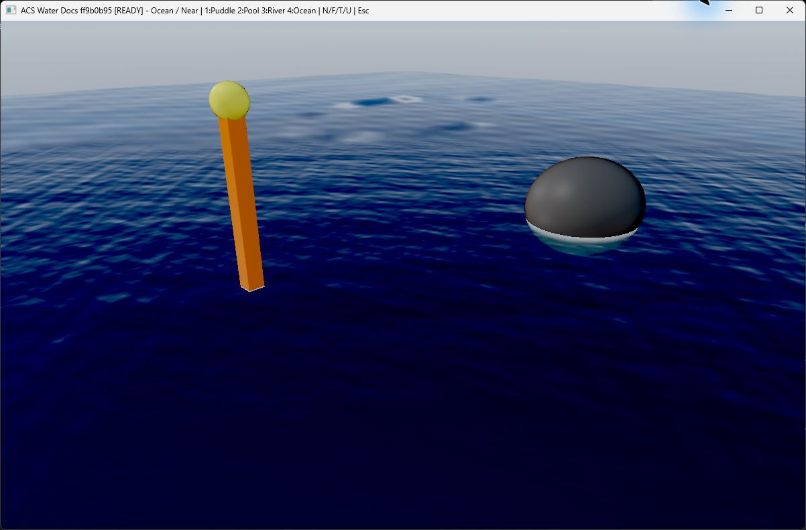
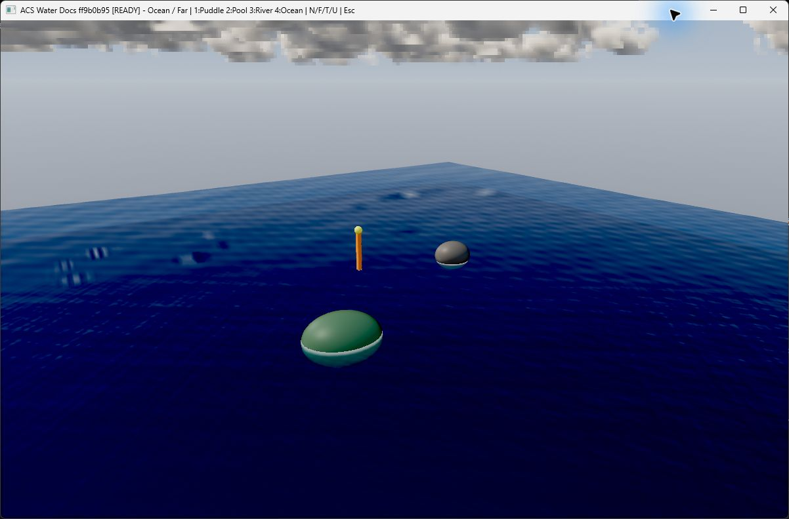
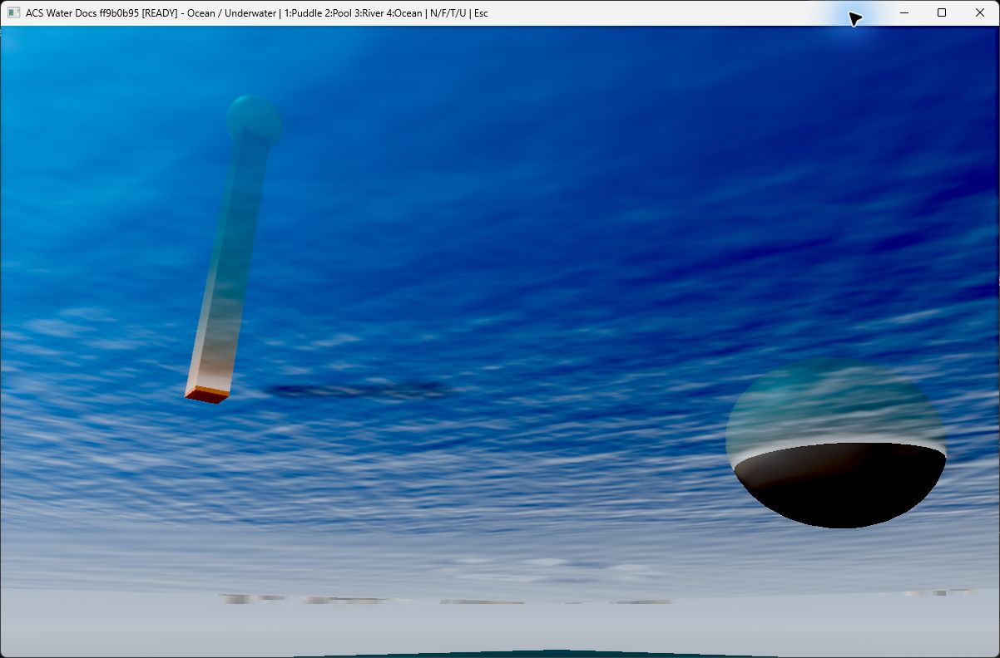
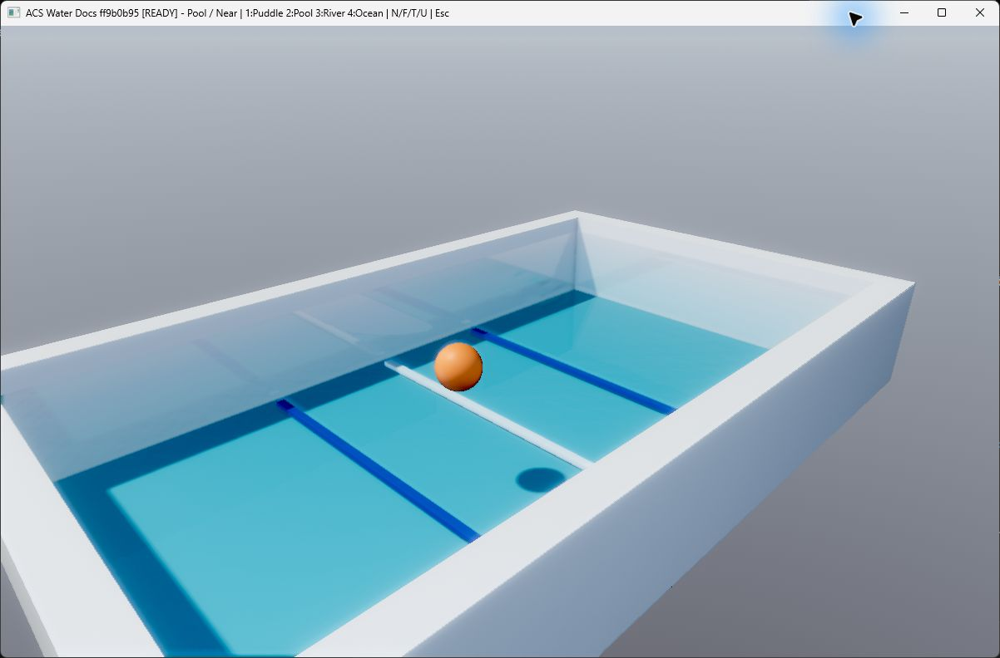
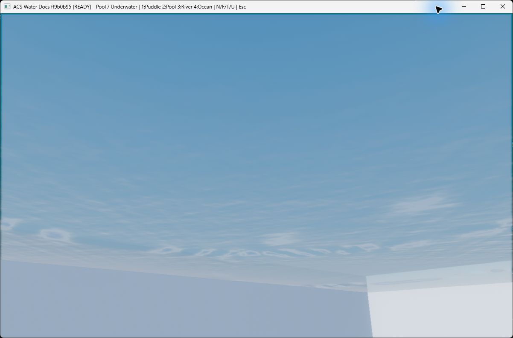
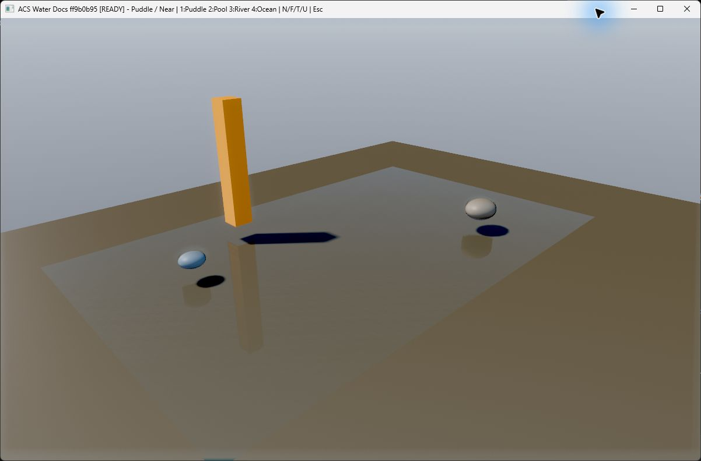
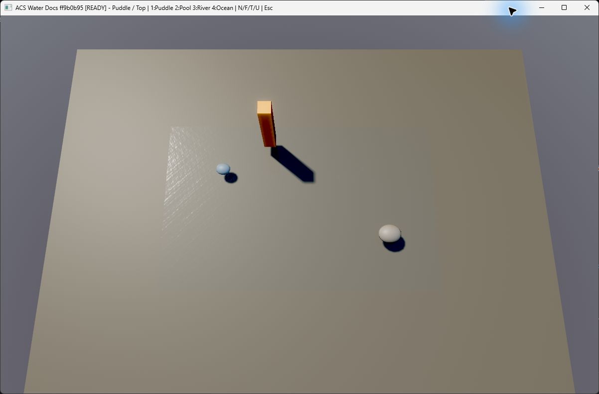
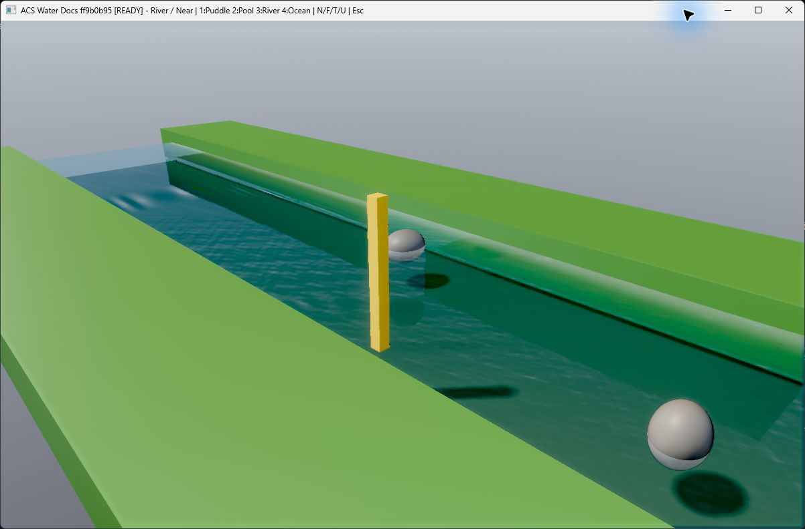
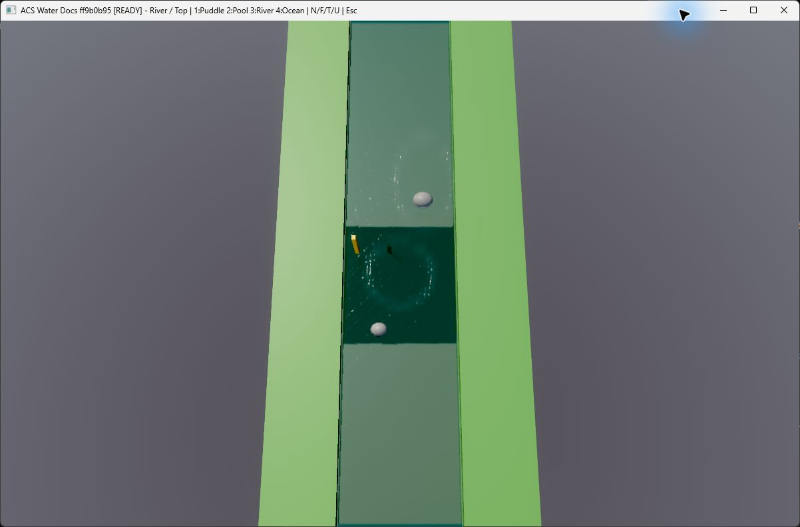

# Interactive Water 3D

`CWaterSurface3D` は、海・湖・川・プール・水たまりを同じ波、光学、動的波紋の
契約で描く、深度書き込み対応の3D水面rendererです。水域ごとに別のshaderを持たず、
形状、用途別の初期値、描画時の格子密度だけを分離します。既存の
`AWaterSurface3DComponent`、local XZ mesh、`FNodeId`単位のinteractionは維持されます。
旧名`FWaterSurface3D`も互換別名として利用できます。

## 実画面

次の画像は`origin/dev`の`ff9b0b95`をRelease構成でビルドし、実Editor ABIのRaw DX12経路を
通常のWin32 hostから起動して撮影したものです。水面実装は`ea858072`と同一で、全画像は
1202×792のwindow captureです。色補正、切り抜き、生成画像への置換は行っていません。

### 海

| 近景 | 遠景 |
|---|---|
|  |  |

近景では解析波と微細法線、深いBeer-Lambert吸収、動的な波紋を確認できます。遠景では
適応格子の端点を維持したまま広い面を覆い、水面下では同じ波面とobjectの境界が連続します。

### プール

| 近景 | 水面下 |
|---|---|
|  |  |

透明度の高い`Pool` profileでも水面が消えず、底面、壁、浮遊objectのdepth順を保ちます。
水面下からは低い波高と裏側の法線反転を確認できます。

### 水たまり

| 近景 | 俯瞰 |
|---|---|
|  |  |

`Puddle` profileは数cm相当の薄い水膜として地面を透過し、objectと影を残したまま局所反射と
細かな波紋だけを加えます。輪郭が必要な場合は同じprofileを任意のlocal XZ meshへ適用します。

### 川

| 近景 | 俯瞰 |
|---|---|
|  |  |

`River` profileでは流れ方向へ波と航跡が進み、岸との接触泡、川底の透過、複数objectの
depth順が同じsurface内で一致します。撮影hostは11870 frame継続し、衝撃と航跡の周期追加後も
正常終了しました。

## 共通の物理層

- 16成分の分散波は重力から位相速度を求め、縦変位と上限付きGerstner横変位を同じ
  位相から作ります。pixel側で解析法線を再評価し、遠距離では画面上のpixel幅を超える
  周波数を減衰させます。
- 多成分のtile可能な微細法線、任意のauthoring済み法線texture、解析波の勾配を一つの
  接線frameで合成します。画面上の法線分散をroughnessへ加えるため、遠景のちらつきや
  点状の強すぎる反射を抑えます。
- 水の屈折率1.333、Schlick Fresnel、Snell屈折、Beer-Lambert吸収、単一散乱、
  Henyey-Greenstein位相関数、GGX太陽反射、SSRと環境反射のfallbackを使います。
  scene depthがある場合は水底までのworld距離から厚みと接触泡を求めます。
- 動的な衝撃と航跡は高さ、法線、泡で同じ寿命包絡を使います。波長に対して急すぎる
  入力は高さを滑らかに飽和させ、余ったenergyを砕波泡へ移すため、小さな水面へ大きな
  strengthを渡しても鋸歯状の面になりません。

## 大きさと形状

矩形の海、湖、プールには`CreateAdaptivePlaneMesh`で一度だけ正規化XZ格子を作り、
`DrawAdaptivePlane`で描画します。既定の96×96格子は頂点数を増やさず、cameraを水面へ
射影した位置へX/Zそれぞれの密度を連続的に寄せます。端点と全体寸法は維持されるため、
数mのプールと広い海でも同じmeshとmodel matrixを使い、camera近傍の密度を保てます。Editorと
`ALegacyScene3DAdapter`の標準Plane水面もこの経路を使います。格子の作成または保持に失敗した場合、
Legacy場面は初期化を続け、既存Plane meshを`DrawMesh`へ渡す代替処理で水面を残します。

輪郭を持つ水たまりや蛇行する川は、従来どおりlocal XZの任意meshを`DrawMesh`へ渡します。
法線、UV、非一様X/Z scale、回転、平行移動は維持されます。任意meshは輪郭を変形しないため、
最短のauthoring済み波長を表現できる分割数を用意してください。

水面はcameraが上側・下側のどちらにある場合も法線をview側へ向け、同じ境界で反射と透過を
評価します。水中全体のfogや浮力volumeは水面rendererの所有外なので、必要なsceneでは
別のvolume機能を組み合わせます。

## 太陽影とCSM atlas

通常の単一shadow mapは従来どおり`SetShadowMap`と既存の`DrawMesh`、
`DrawAdaptivePlane`で利用できます。横方向へ最大4段を並べたCSM atlasでは、呼び出し元が
`FShadowCascadeSet`へtexture、各light view-projection、view-space分割深度、bias、PCF半径を
設定し、`DrawMeshWithShadowCascades`または`DrawAdaptivePlaneWithShadowCascades`へ渡します。
descriptorはdraw中だけ参照され、textureの所有権と寿命は呼び出し元に残ります。

shaderはpixelのview-space深度でcascadeを選び、末尾15%で次段へ混ぜます。PCF sampleは各段の
half texel内側へ制限するため、隣接cascadeの無関係な深度が海面へ巨大な黒帯として漏れません。
最遠段の末尾は受影なしへ滑らかに戻します。cascade数、atlas寸法、行列、分割深度が不正な場合も
水面draw自体は続け、受影だけを無効にします。

## 用途別profile

`FWaterSurface3DParams::ForProfile`は形状を所有せず、同じrendererへ渡す安全な初期値だけを
返します。`AWaterSurface3DComponent::ApplyProfile`でも既存の公開fieldへ同じ値を適用できます。

| profile | 想定する特徴 |
|---|---|
| `Puddle` | 数cmの厚み、細かな波、低い屈折、泡なし |
| `Pool` | 高い透明度、低い波高、規則的な微細波 |
| `River` | 一方向の流れ、短い航跡、濁りと接触泡 |
| `Lake` | 穏やかな中距離風波と環境反射 |
| `Ocean` | 長波長、強い風波、深い光学距離と白波 |

profile適用後も個々のfieldを上書きできます。既存defaultとfield名・型は変更していないため、
既存sceneとFrameworkの直接authoringはそのまま動作します。

## interactionと所有権

- 衝撃16件、航跡48件をsurfaceごとに独立して確保し、新しい航跡が生存中の衝撃を
  上書きしません。
- 一つのrendererは最大64 surfaceを追跡します。Editor node IDまたはFrameworkの`FNodeId`を
  安定したkeyとして使い、削除時は対象surfaceだけをclearします。
- `AddWakeSegmentForSurface`は低頻度の3D移動を再sampleし、実sample間隔と波束幅に応じて
  energyを正規化します。更新頻度やsample spacingだけで航跡が巨大な溝になりません。
- idle時は解析位相だけをO(1)で進め、更新とGPU uploadは生存event数に比例します。

## frame順序

Editorはopaque geometryの後、大気・雲・local fogの前に水を描きます。

1. 波高と波紋を含む保守的boundsでfrustum判定する。
2. 可視水面がなければcolor/depth copyとfullscreen処理を行わない。
3. opaque HDR colorとdepthを不変snapshotへcopyする。
4. live depthを再bindし、水面をdepth test/write付きで描く。
5. 大気、雲、fog、post processを水面depthまで合成する。
6. Editor専用gizmoをpost process後に描く。

これにより、前景opaqueによる遮蔽、複数水面間のdepth順、屈折、SSR、接触泡、雲とfogの
終端が同じframeで一致します。depth copyに失敗した場合はopaque PBR fallbackを描き、
一frameだけ水面が消える状態を作りません。

## 検証

`water3d_ripple_lifetime_tests.cpp`はsurface分離、capacity、寿命、航跡energy、profile、
砕波、法線、適応格子、CSM atlas境界の契約を検証します。適応格子のGPU upload、境界、profile既定値も
同じ水面testで検証します。`legacy_scene3d_water_adaptive_contract_tests.cpp`は標準Planeの
適応描画、任意XZ meshの形状維持、格子失敗時の代替処理、reload/release所有権を固定します。
raw DX12とDiligentの実pipeline初期化により、embedded HLSLとRHI resource bindingを確認します。
