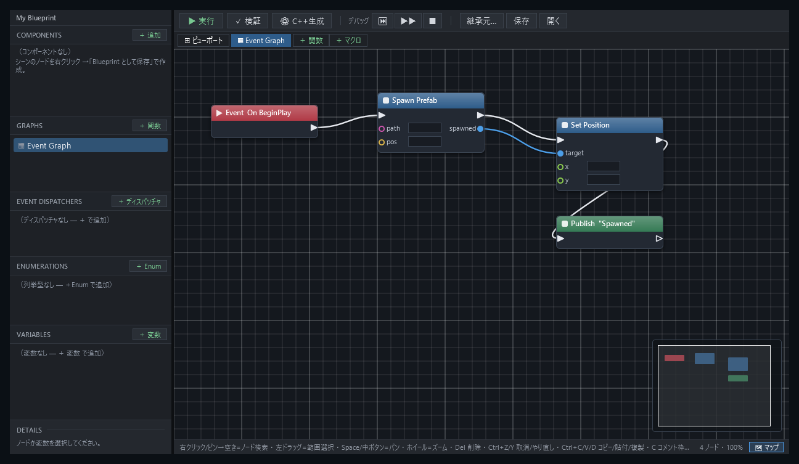
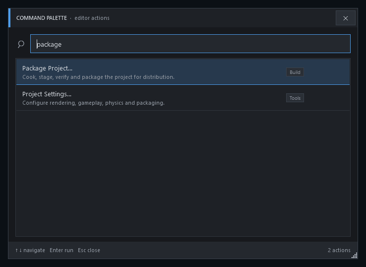

# ACS Editor アーキテクチャ

ACS Editor は、ACS のプロジェクト、シーン、アセット、Blueprint、マテリアル、診断情報を編集する Windows x64 アプリケーションです。実装は `editor/AcsEditor/` の WPF アプリケーションと、`src/editor_abi/` のネイティブ描画境界に分かれます。

## 実行境界

| 要素 | 実装 | 責務 |
|---|---|---|
| `AcsEditor.exe` | C# / WPF / `net10.0-windows` | ウィンドウ、入力、編集状態、パネル、永続化 |
| `acs_editor_abi.dll` | C++ / Raw DX12 | 外部 `HWND` への描画、ACS の型情報と実行時機能への接続 |
| Editor 文書モデル | C# | シーン、アセット、Project Settings、Workspace の編集状態 |
| ACS ランタイム | C++ モジュール | 描画、Asset、Game Framework、Reflection |

WPF 側は P/Invoke で `acs_editor_abi.dll` を呼び出します。DLL が配置されていない場合でも、ネイティブ描画を必要としない Editor 機能と視覚検証用フィクスチャは独立して動作できます。

## ドキュメントモデル

Editor は1つの管理対象文書で文書識別子、選択、Undo、Redoを管理し、その内側に2D用と3D用の互換データを保持します。ソースアダプターとシリアライザーは2D用と3D用に分かれており、未変換の `.acscene` ではPerspective表示を利用できません。

詳細は[単一シーンドキュメント](../decisions/0001-single-scene-document.md)を参照してください。

## 主な領域

- Project Launcher と Project Settings
- シーン階層、ビューポート、選択、詳細表示
- Content Browser と Asset Import Settings
- Blueprintグラフと生成C++
- ACS Material Editorとプレビュー
- Performance Profiler、メモリ、診断
- Workspace、ドック配置、Command Palette
- Package Metadataと配布前確認

編集可能な値はビューの一時状態へ直接保存せず、文書モデルまたは機能ごとのサービスを経由して変更します。複数選択では、全対象の共通値、混在値、適用失敗を区別します。

<figure>
  <a href="../media/captures/edited/editor/blueprint-editor.png"><picture><source media="(max-width: 700px)" srcset="../media/captures/edited/editor/mobile/blueprint-event-flow.png" width="522" height="202"></picture></a>
  <figcaption>イベント、関数、マクロ、変数をグラフ上で接続します。狭い画面では主要な接続を拡大し、画像を選択すると全体を原寸で表示します。</figcaption>
</figure>

<figure>
  
  <figcaption>Command Palette は入力語に一致する Editor 操作を絞り込みます。画像を選択すると原寸で表示します。</figcaption>
</figure>

## 所有権と更新

- メインウィンドウがアプリケーション全体のサービスと主要パネルを所有します。
- 文書がシーンとアセットの編集状態を所有します。
- ビューは表示と入力変換を担当し、永続化の正本にはなりません。
- Content Browserの読み込みと保存、シーンの読み込みでは、`CancellationToken`または世代確認によって古い結果の反映を防ぎます。
- 文書の切り替え、終了、再読み込みでは、保留中の編集を確定または破棄してから所有対象を解放します。

## ネイティブプレビュー

`acs_editor_abi.dll` は Raw DX12バックエンドを利用し、Editor 内の外部 `HWND` へスワップチェーンを作成します。WPF 側はハンドルと表示サイズを渡し、C++ 側がACSのRenderモジュールとGame Frameworkの型情報へ接続します。ABIを変更した場合は、C#宣言とC++エクスポートを同じ構成で検証します。

契約版、必須機能ビット、任意サービス診断、失敗時の無効化については[Editor ネイティブ ABI](editor-abi.md)を参照してください。ホストの非同期作成と世代管理については[起動時の応答性](../guides/editor/startup-responsiveness.md)を参照してください。

## 視覚検証

Editor は主要パネルを画面外へ描画してPNGを保存できるフィクスチャを持ちます。フィクスチャは実データを模した決定的な状態を使い、起動中のウィンドウや入力フォーカスに依存せず比較できます。

- `--asset-package-readiness-visual-fixture`
- `--package-metadata-editor-visual-fixture`
- `--asset-import-settings-visual-fixture`
- `--profilershot`
- `--workspaceshot`
- `--paletteshot`
- `--bpshot`
- `--colorshot`

利用方法は[Editor ガイド](../guides/editor/README.md)と[パッケージ作成](../operations/packaging/README.md)を参照してください。
