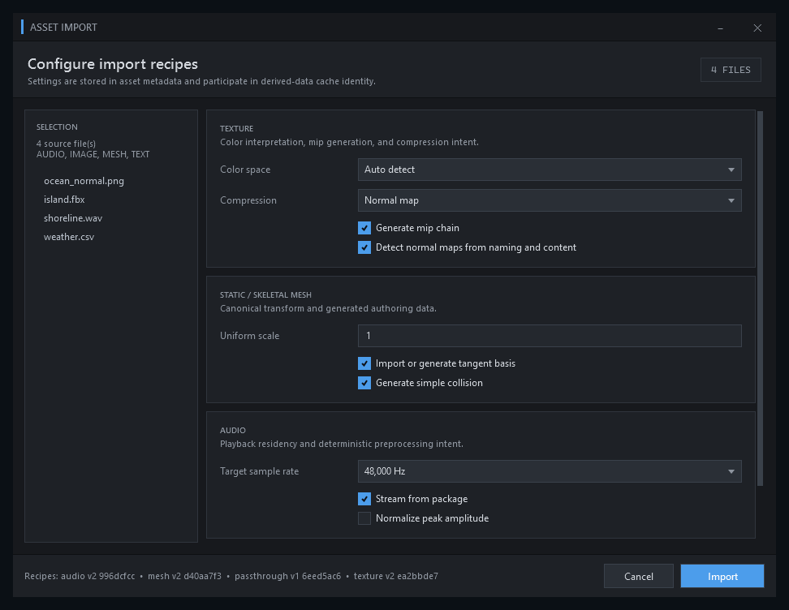

# アセットのインポート設定

ACS Editor のアセットインポート設定は、入力形式ごとの変換条件と Derived Data Cache
（入力から再生成できる中間データ）の識別子を管理します。

## 操作

- `Import`操作では設定画面を開き、選択内容を確認してから実行します。
- ドラッグ＆ドロップでは、直前に確定した互換性のある設定プロファイルを再利用します。
- テクスチャ、メッシュ、音声、無変換のアセットを同じ選択へ含められます。
- 無効な値が1件でもある場合は`Import`を開始しません。

## 形式別設定

| 種別 | 設定 |
|---|---|
| テクスチャ | 色空間の自動判定、`srgb`、`linear`、`default` / `normal-map` / `hdr` / `ui` / `mask`圧縮 |
| メッシュ | 一様倍率`0.0001`〜`10000`、接線生成、衝突判定データ生成 |
| 音声 | ストリーミング、正規化、サンプルレート |
| 無変換 | ソースのバイト列を保った登録 |

<figure>
  
  <figcaption>入力形式ごとの設定を確認してからインポートを開始します。画像を選択すると原寸で表示します。</figcaption>
</figure>

## 永続化

確定したプロファイルは `Saved/Editor/AssetImporterSettings.v1.json` へ保存します。
スキーマバージョンは 1、最大サイズは 64 KiB です。未知フィールド、重複フィールド、不正な型、
上限外の値は拒否し、既存設定を部分更新しません。同じディレクトリの一時ファイルをフラッシュした後に
置換し、プロジェクトルートからプロファイルまでの再解析ポイントを拒否します。

プロジェクトを切り替えると、メモリ上の設定はいったん既定値へ戻り、新しいプロジェクトのプロファイルだけを読み込みます。以前のプロジェクトから遅れて完了した読み込みはプロジェクト世代で拒否します。

## Derived Data Cache の扱い

キャッシュキーはソース内容、インポートプロファイル、インポーターバージョンから決まります。
レシピは最大 128 設定、正規化対象の UTF-8 は最大 192 KiB です。キャッシュエントリは固定マジック値、
スキーマ、32 バイトのキー、データ本体の SHA-256、長さを持ち、全フィールドを検証します。
現在の処理済みデータは `source-preserving-v1` であり、GPU 用テクスチャやネイティブメッシュへの
最終変換物ではありません。

## 変更の確定

インポートは検証済みプロファイルの固定値を受け取り、処理途中のUI変更を参照しません。
`Import`開始前に、その固定値をプロジェクト内のプロファイルへ原子的に保存します。保存に失敗した場合は`Import`を開始せず、設定を永続化できないままアセットだけを追加することはありません。
生成物の公開前にソースの長さと SHA-256 を再確認し、ソースが変化していた場合は失敗として扱います。
アセット本体、`.acsmeta`、Asset Database の索引は段階ごとにジャーナルへ記録し、キャンセルまたは
公開失敗では、この処理が公開した内容だけをロールバックします。

パス検証、レシピ、キャッシュエンベロープ、公開順序の詳細は
[アセットインポートの永続化契約](../../safety/assets/asset-import-persistence.md)を参照してください。
