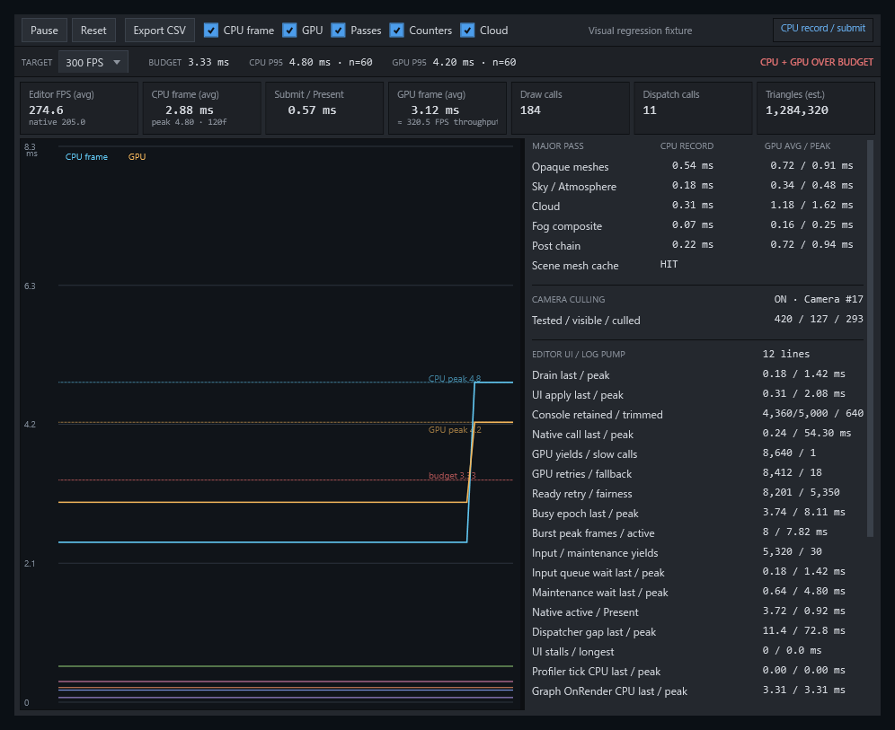

# パフォーマンスプロファイラー

ACS Editor の `Performance Profiler` は、Editor が観測した提示間隔、ネイティブ描画が報告する時間、非同期 GPU 問い合わせを区別して表示します。

## 各指標の意味

- Editor が観測する FPS は、`Stopwatch` の経過時間と、同じ区間で増えたネイティブ提示フレーム番号から求めます。`Dispatcher` のスケジュール遅延と提示停止を含むため、Editor 全体で観測した提示頻度です。
- ネイティブ報告 FPS は、ネイティブ描画側の平滑化したフレーム間隔です。短い連続描画では Editor が観測する FPS より高くなることがあるため、診断値として分けて表示し、単独では性能承認に使いません。
- CPU フレーム時間 `CpuFrameMs` は、`BeginProfilerFrame` から提示成功後のスナップショット公開までの CPU 時間です。描画命令の記録と終端の送信・`Present` を含みます。
- ネイティブ有効 CPU 時間 `NativeRenderActiveCpuMs` は、GPU が新しいフレームを受理できることを確認した後から、終端の送信を始める直前までの CPU 時間です。`Dispatcher` の待ち時間と GPU 使用中の再試行時間を含みません。
- `Present` CPU 時間 `NativePresentCpuMs` は、終端の送信と `Present` 呼出しに要した CPU 時間です。GPU タイムスタンプでも、表示装置へ走査されるまでの時間でもありません。
- GPU フレーム時間 `GpuFrameMs` は、非同期タイムスタンプ問い合わせが完了したフレームの GPU 時間です。CPU 時間を GPU 時間として代用しません。

`Presented` は、ACS が描画命令の送信を完了し、スワップチェーンの `Present` 呼出しが成功したことを意味します。表示装置が同数の異なる画像を走査したことは証明しません。実際の表示頻度は、表示装置、DWM、ドライバーの提示方針にも制限されます。

## 標本取得と履歴

パネル表示中は100 ms、非表示時は500 ms間隔でネイティブスナップショットを確認します。非表示でも履歴と状態表示は更新しますが、詳細な WPF 表示はパネルが見えており、かつネイティブフレーム番号が進んだ場合だけ更新します。

履歴は同じネイティブフレーム番号を重複登録せず、直近120件を保持します。100 ms間隔は全描画フレームの取得を意味しません。GPU の履歴には、個別に完了した問い合わせだけを登録します。

## フレーム予算

目標 FPS の既定値は300で、フレーム予算は3.33 msです。画面では60、120、144、240、300、360 FPSを選択でき、解析処理は1〜1000 FPSを受け付けます。目標値の変更は解析だけに使い、描画品質、フレーム上限、標本取得間隔を変更しません。

CPU と GPU の P95 は、直近120件以内の利用可能な標本を昇順に並べ、95%位置を切り上げた順位の値を使います。CPU は `CpuFrameMs`、GPU は個別に完了した `GpuFrameMs` を使い、GPU の移動平均を繰り返し標本化しません。各値には標本数 `n` と、予算超過件数を併記します。

状態表示は次のとおりです。

- `WAITING`: CPU 標本がまだない。
- `WITHIN BUDGET`: CPU P95 と、利用可能な場合の GPU P95 が予算内である。
- `CPU OVER BUDGET`: CPU P95 だけが予算を超えている。
- `GPU OVER BUDGET`: GPU P95 だけが予算を超えている。
- `CPU + GPU OVER BUDGET`: CPU と GPU の両方が予算を超えている。

GPU 問い合わせなど利用できない値は0として扱わず、画面と CSV では `N/A` とします。GPU 標本がないことだけを理由に0 msまたは予算内とは判定しません。

<figure>
  <a href="../../media/captures/edited/editor/performance-profiler.png"></a>
  <figcaption>フレーム時間、パス別時間、負荷の履歴を同じ画面で確認します。画像を選択すると原寸で表示します。</figcaption>
</figure>

## 画面からの CSV 出力

`Export CSV` は、選択中の目標 FPS、フレーム予算、`Stopwatch` 周波数をメタデータへ記録します。各行には次を出力します。

```csv
frame_index,sample_timestamp,native_reported_fps,cpu_frame_ms,cpu_submit_ms,native_render_active_cpu_ms,native_present_cpu_ms,native_render_active_cpu_peak_ms,native_present_cpu_peak_ms,presented_frame_count_since_reset,profiler_reset_serial,gpu_query_ms,gpu_window_average_ms,opaque_cpu_ms,atmosphere_cpu_ms,cloud_cpu_ms,fog_cpu_ms,post_cpu_ms
```

列の順序は固定です。`sample_timestamp` は `Stopwatch` の刻み値、`native_render_active_cpu_peak_ms` と `native_present_cpu_peak_ms` は移動最大値です。利用できない個別 GPU 問い合わせと GPU 問い合わせ窓平均は `N/A` とします。末尾5列は、不透明描画、大気、雲、霧、後処理の CPU 時間です。

保存先の確認後、同じディレクトリの一意な一時ファイルへ書き、選択した出力ファイルへ原子的に置き換えます。失敗時は既存ファイルを削除または切り詰めません。

`--interaction-soak` と組み合わせる無人キャプチャーは、出力先制限、リセット世代、`ProfilerSummary`、実行時タイムライン、失敗コードを追加します。詳しくは[パフォーマンスプロファイラーのキャプチャー](profiler-capture.md)を参照してください。

## 検証

```pwsh
AcsEditor.exe --profiler-selftest
AcsEditor.exe --profilershot profiler.png
```

`--profiler-selftest` は標本間隔、重複排除、P95、予算状態、`N/A`、CSV 列、GPU 問い合わせの世代を検証します。`--profilershot` は決定的な表示データで画面配置を確認するための画像を作りますが、性能値の合否判定には使用しません。
