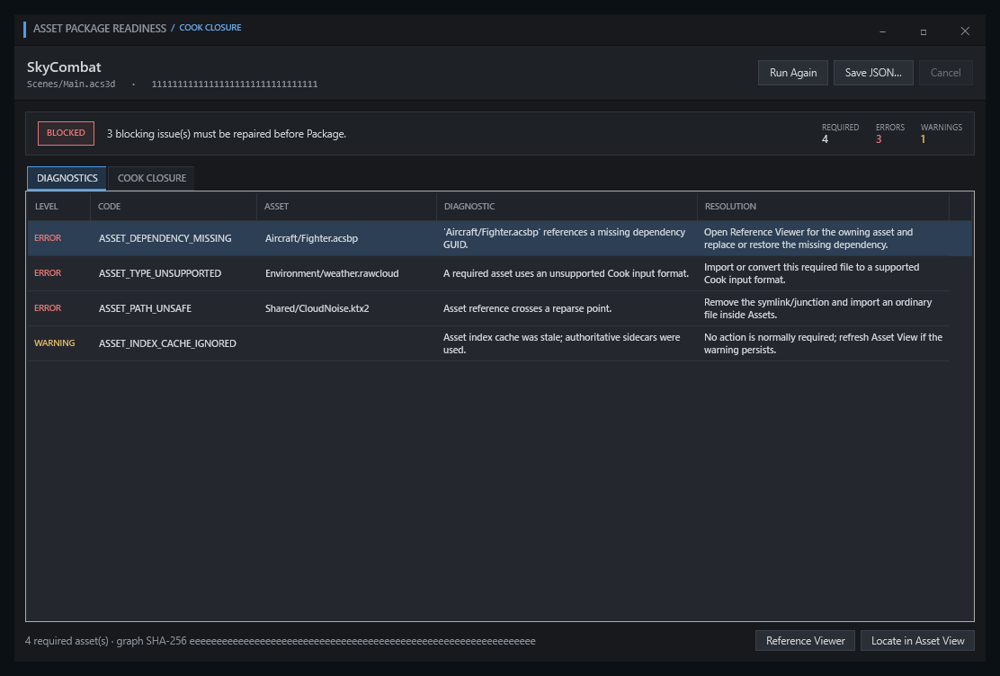

# アセットのパッケージ準備確認

Asset View の `Asset Actions > Package Readiness` は、パッケージ作成と同じ依存閉包計画を読み取り専用で作成し、配布対象アセットの不足と不整合を表示します。

## 表示内容

- ルートシーンから到達する必須アセット
- 不足している依存アセット
- 未対応形式
- 古いメタデータとキャッシュ
- 安全でないパスと再解析ポイント
- `AssetRecord.RelativePath` が示すソースアセットの相対パス、Asset ID、種別、元のサイズ、元の SHA-256

診断にエラーが 1 件もない場合だけ `Ready` になります。解析中に元のアセットは変更しません。

## 修復への移動

アセットパスを持つ診断では`Locate`を使い、Asset Viewの該当ファイルへ移動できます。Asset IDを持つ診断では`Reference Viewer`を開き、参照元、欠落依存、循環を確認できます。診断ごとの修復説明には、再インポート、Project Settingsでの正規シーン選択、パス修正など、該当するACS操作を示します。

Package Readinessを開いた時点で、プロジェクト名、プロジェクトルート、Assetsルート、`canonicalSceneAssetId`を一つの要求値へ固定します。`Locate`と`Reference Viewer`を後から実行する際は、Asset Databaseとプロジェクト世代が開始時と同じ場合だけAsset Viewへ反映します。別のプロジェクトへ切り替わった後の遅延操作は無視します。

<figure>
  
  <figcaption>到達可能なアセットと診断を確認します。画像を選択すると原寸で表示します。</figcaption>
</figure>

## 上限

- 到達可能グラフは最大 65,536 アセット
- 依存関係を走査するテキストアセットは 1 ファイルあたり最大 64 MiB
- 取消後は古い解析結果を UI へ反映しない

再実行時は直前のレポート、診断、閉包一覧を先に消去します。解析が最後まで完了し、開始時の解析世代が有効な場合だけ結果全体を一度に表示します。取消または失敗では途中まで得た診断やアセットを公開せず、JSON保存も有効にしません。

## JSON 形式のレポート

レポートのスキーマバージョンは 1 です。同じディレクトリの一時ファイルから新しい出力先へ公開し、既存のファイルまたはディレクトリがある出力先は拒否します。レポートは同じ入力から決定的な順序で生成します。

一覧の相対パス、サイズ、SHA-256はソースアセットの値です。正規シーンの`main.acscene`への変更、変換後のデータ本体、Cook後のサイズとSHA-256は表しません。この確認はアセット閉包の準備状態を示すものであり、実行ファイル、アーカイブ、起動確認、署名の成功は別に確認します。
